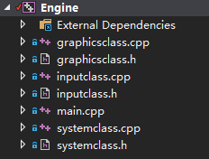

# Framework

虽然只是教学，但还是建议大家养成工整的文件树的习惯，先为程序设计一个合理的Basic Framework，像这样，熟悉Windows.h的朋友应该知道，WinMain是创建窗口的类


创建下面这几个文件

- main.cpp 程序的入口
- SystemClass.cpp & SystemClass.h 管理各个组件
- InputClass.cpp & InputClass.h        管理输入事件
- GraphicsClass.cpp & GraphicsClass.h  管理图形相关的组件

也就是这样



# main

main作为EntryPoint，但是并不在这里写各种资源分配，而是封装在SystemClass里，而main则是调SystemClass的创建，初始化，销毁Function

```cpp
int WINAPI WinMain(HINSTANCE hInstance, HINSTANCE hPrevInstance, PSTR pScmdline, int iCmdshow)
{
	SystemClass* System;
	bool result;
	
	
	// Create the system object.
	System = new SystemClass;
	if(!System)
	{
		return 0;
	}

	// Initialize and run the system object.
	result = System->Initialize();
	if(result)
	{
		System->Run();
	}

	// Shutdown and release the system object.
	System->Shutdown();
	delete System;
	System = 0;

	return 0;
}
```

# SystemClass

## Life Circle

- 创建

  ```cpp
  SystemClass::SystemClass()
  {
  	m_Input = 0;
  	m_Graphics = 0;
  }
  ```

- 初始化：Window，Input，Graphics

  ```cpp
  screenWidth = 0;
  screenHeight = 0;
  InitializeWindows(screenWidth, screenHeight);
  
  m_Input = new InputClass;
  m_Input->Initialize();
  
  m_Graphics = new GraphicsClass;
  result = m_Graphics->Initialize(screenWidth, screenHeight, m_hwnd);
  ```

- 销毁：同上

  ```cpp
  void SystemClass::Shutdown()
  {
  	if(m_Graphics)
  	{
  		m_Graphics->Shutdown();  //先调Shutdown删除依赖
  		delete m_Graphics;       //再删除这块内存
  		m_Graphics = 0;          //置0，以下同理
  	}
  
  	if(m_Input)
  	{
  		delete m_Input;
  		m_Input = 0;
  	}
  
  	ShutdownWindows();           //清空Window
  	
  	return;
  }
  ```

## Core

- Run：监听事件-> (有没有按下ESC)？ return ：Frame（）

  ```cpp
  void SystemClass::Run()
  {
  	MSG msg;
  	bool done, result;
  
  	// 先清空这块内存，进行初始化
  	ZeroMemory(&msg, sizeof(MSG));
  	
  	done = false;
  	while(!done)
  	{
  		// Handle the windows messages.
  		if(PeekMessage(&msg, NULL, 0, 0, PM_REMOVE))
  		{
  			TranslateMessage(&msg);
  			DispatchMessage(&msg);
  		}
  
  		// If windows signals to end the application then exit out.
  		if(msg.message == WM_QUIT)
  		{
  			done = true;
  		}
  		else
  		{
  			// Otherwise do the frame processing.
  			result = Frame();
  			if(!result)
  			{
  				done = true;
  			}
  		}
  
  	}
  
  	return;
  }
  
  ```

- Frame（）：渲染框架 -> (按下ESC？) 返回 ： 渲染

  ```cpp
  bool SystemClass::Frame()
  {
  	bool result;
  
      //监听ESC
  	if(m_Input->IsKeyDown(VK_ESCAPE))
  	{
  		return false;
  	}
  
      //递归调Graphics的Frame()方法
  	result = m_Graphics->Frame();
  	if(!result)
  	{
  		return false;
  	}
  
  	return true;
  }
  ```

- WndProc：熟悉Windows窗口的同学就知道，这是消息回调函数（来自Windows.h），用来写处理消息的代码，这里定义了两种消息的处理

  - 窗口关闭的消息
  - 后续处理的消息，也就是程序结束后的一些shutdown操作

  ```cpp
  LRESULT CALLBACK WndProc(HWND hwnd, UINT umessage, WPARAM wparam, LPARAM lparam)
  {
  	switch(umessage)
  	{
  		case WM_DESTROY:
  		{
  			PostQuitMessage(0);
  			return 0;
  		}
  
  		case WM_CLOSE:
  		{
  			PostQuitMessage(0);		
  			return 0;
  		}
              
  		default:
  		{
  			return ApplicationHandle->MessageHandler(hwnd, umessage, wparam, lparam);
  		}
  	}
  }
  ```

  

# InputClass

暂时只是定义各个按键的事件，并没有实际效果

```cpp
class InputClass
{
public:
	InputClass();
	InputClass(const InputClass&);
	~InputClass();

	void Initialize();

	void KeyDown(unsigned int);
	void KeyUp(unsigned int);

	bool IsKeyDown(unsigned int);

private:
	bool m_keys[256];
};

```


# GraphicsClass

同上，只定义了行为，还没写实现

```cpp
class GraphicsClass
{
public:
	GraphicsClass();
	GraphicsClass(const GraphicsClass&);
	~GraphicsClass();

	bool Initialize(int, int, HWND);
	void Shutdown();
	bool Frame();

private:
	bool Render();

private:

};
```


至此框架搭完了，运行起来应该会得到一个黑窗口


还真是够黑的，连menu都没有，想要完整的窗口的话，可以参阅MSDN，可以调这个Function实现，因为需要修改代码结构，这里就不演示了

```cpp
HWND CreateWindowExA(
  DWORD     dwExStyle,
  LPCSTR    lpClassName,
  LPCSTR    lpWindowName,
  DWORD     dwStyle,
  int       X,
  int       Y,
  int       nWidth,
  int       nHeight,
  HWND      hWndParent,
  HMENU     hMenu,
  HINSTANCE hInstance,
  LPVOID    lpParam
);
```

