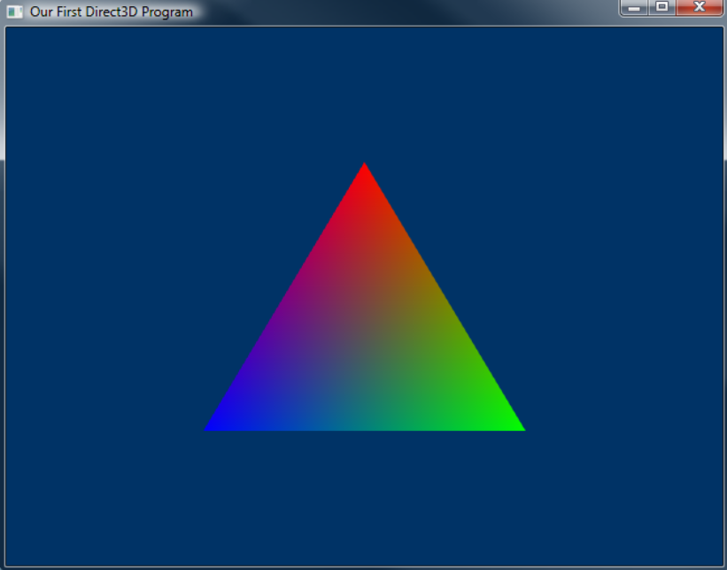

# How to Draw a triangle？

就算只是画个三角形，也并不是一件容易的事，因为三角形是基本拓扑结构，这将会cover到渲染的大部分流程，我们从头说起

1. 为render pipline准备好shader，从而告诉GPU我们要如何渲染

2. 创建三个Vertex对象，将Vertex传入GPU内存

3. 告诉GPU渲染的模式（三角形 & 自定义..etc）

4. 渲染


# 1.Shader

什么是Shader？翻译过来就是着色器，用来给像素上色，Shader分为两种：

- Vertex Shader  简称vs 用于渲染顶点 
- Fragment Shader / Pixel Shader 简称fs/ps  用于渲染顶点间的区域

Shader怎么玩？基本上就是分为以下三步

- 从.shader文件中加载并编译shader源码（用hlsl编写）**[当然这是最关键的]**
- 将shader代码封装成shader对象
- 将shader对象设为active


一般用到以下几个API

## Compile From .shader file 编译源文件

```cpp
//编译API
HRESULT D3DX11CompileFromFile(
    LPCTSTR pSrcFile,                // 文件路径
    D3D10_SHADER_MACRO *pDefines,    // advanced
    LPD3D10INCLUDE pInclude,         // advanced
    LPCSTR pFunctionName,            // starting fuction's name
    LPCSTR pProfile,                 // shader的简介
    UINT Flags1,                     // advanced
    UINT Flags2,                     // advanced
    ID3DX11ThreadPump *pPump,        // advanced
    ID3D10Blob **ppShader,           // 用于存放编译后的shader文件的buffer的指针
    ID3D10Blob **ppErrorMsgs,        // advanced
    HRESULT *pHResult);              // advanced

```

举个简单的例子就是

```cpp
ID3D10Blob *VS; // 存放编译后代码的Blob
D3DX11CompileFromFile("shaders.shader", 0, 0, "VShader", "vs_4_0", 0, 0, 0, &VS, 0, 0);
```

## Encapsulate 封装对象

```cpp
// shader对象
ID3D11VertexShader *pVS;    // the vertex shader
ID3D11PixelShader *pPS;     // the pixel shader

// Compiling .shader file
ID3D10Blob *VS, *PS;
D3DX11CompileFromFile(L"shaders.shader", 0, 0, "VShader", "vs_4_0", 0, 0, 0, &VS, 0, 0);
D3DX11CompileFromFile(L"shaders.shader", 0, 0, "PShader", "ps_4_0", 0, 0, 0, &PS, 0, 0);

// Create Shader
dev->CreateVertexShader(VS->GetBufferPointer(), VS->GetBufferSize(), NULL, &pVS);
dev->CreatePixelShader(PS->GetBufferPointer(), PS->GetBufferSize(), NULL, &pPS);
```

## Set as active

```cpp
// 当前shader设为我们的shader
devcon->VSSetShader(pVS, 0, 0);
devcon->PSSetShader(pPS, 0, 0);
```

至此就成功指定了自定义的shader了，关于如何写.shader文件，下节再说


# 2.Vertex Buffer 顶点缓存

前面其实也有说过，Vertex Buffer就是用来存顶点信息的，顶点除了位置，还有其他东西，比如颜色，而Vertex Buffer就是用来存放这些信息的

简单来创建一个Vertex struct

```cpp
struct VERTEX //假设我们只需要坐标和color
{
      FLOAT X, Y, Z;
      D3DXCOLOR Color;
};
```

假设我们要画一个三角形，那么我们就得准备3个vertex

```cpp
VERTEX OurVertices[] = //color的四个参数分别是rgbo
{
    {0.0f, 0.5f, 0.0f, D3DXCOLOR(1.0f, 0.0f, 0.0f, 1.0f)},
    {0.45f, -0.5, 0.0f, D3DXCOLOR(0.0f, 1.0f, 0.0f, 1.0f)},
    {-0.45f, -0.5f, 0.0f, D3DXCOLOR(0.0f, 0.0f, 1.0f, 1.0f)}
};
```


## Create Buffer

```cpp
ID3D11Buffer *pVBuffer;    // Buffer对象

D3D11_BUFFER_DESC bd;      //Buffer的属性对象
ZeroMemory(&bd, sizeof(bd));

bd.Usage = D3D11_USAGE_DYNAMIC;                // 用于CPU写和GPU读
bd.ByteWidth = sizeof(VERTEX) * 3;             // 指定Buffer的大小
bd.BindFlags = D3D11_BIND_VERTEX_BUFFER;       // 指定是用于Vertex Buffer
bd.CPUAccessFlags = D3D11_CPU_ACCESS_WRITE;    // 允许CPU写

dev->CreateBuffer(&bd, NULL, &pVBuffer);       // 创建Buffer

```


## Binding/Mapping

我们现在已经有Buffer和Vertices了，剩下就是把这俩绑定起来，或者说，将Vertices写进Buffer里

```cpp
D3D11_MAPPED_SUBRESOURCE ms;
devcon->Map(pVBuffer, NULL, D3D11_MAP_WRITE_DISCARD, NULL, &ms);   // map the buffer
memcpy(ms.pData, OurVertices, sizeof(OurVertices));                // copy the data
devcon->Unmap(pVBuffer, NULL);                                     // unmap the buffer
```


# 3.Verify Input Layout

上面我们已经做完了两件重要的事：

- 将shader安排到render pipline上
- 准备好Vertex数据并写入Vertex Buffer

但有一个问题，我们的Vertex是自定义的，GPU怎么知道我们定义了什么东西，对应要渲染成什么样啊？答案就是Input Layout 自定义一个输入的格式，然后渲染时进行验证

## Input Element

一个 vertex layout 包含一个或多个Input element，每个element代表一个Vertex的属性，比如Positon / color ， 创建一个多属性的layout可以放进一个数组里

```cpp
D3D11_INPUT_ELEMENT_DESC ied[] =
{
    {"POSITION", 0, DXGI_FORMAT_R32G32B32_FLOAT, 0, 0, D3D11_INPUT_PER_VERTEX_DATA, 0},
    {"COLOR", 0, DXGI_FORMAT_R32G32B32A32_FLOAT, 0, 12, D3D11_INPUT_PER_VERTEX_DATA, 0},
};
```

## Layout Object

这步将vertex shader 和 Layout 绑定，这样shader就能正确渲染Vertex对象了

```cpp
ID3D11InputLayout *pLayout;    // global

HRESULT CreateInputLayout(
    D3D11_INPUT_ELEMENT_DESC *pInputElementDescs, //input element
    UINT NumElements,                             //elements的个数
    void *pShaderBytecodeWithInputSignature,      //shader 地址
    SIZE_T BytecodeLength,                        //shader size
    ID3D11InputLayout **pInputLayout);            

//example
//Create Object
dev->CreateInputLayout(ied, 2, VS->GetBufferPointer(), VS->GetBufferSize(), &pLayout);

```

然后同样，激活Layout，将其设为当前使用的layout对象

```cpp
devcon->IASetInputLayout(pLayout);
```


# 4.Do Draw /Render

```cpp
void RenderFrame(void)
{
    // 同之前一样，将back buffer置为蓝色
    devcon->ClearRenderTargetView(backbuffer, D3DXCOLOR(0.0f, 0.2f, 0.4f, 1.0f));

    // 选择要draw()的Vertex对象
    UINT stride = sizeof(VERTEX);
    UINT offset = 0;
    devcon->IASetVertexBuffers(0, 1, &pVBuffer, &stride, &offset);

    // 选择基本拓扑结构(本例是三角形 & 或其他的)
    devcon->IASetPrimitiveTopology(D3D10_PRIMITIVE_TOPOLOGY_TRIANGLELIST);

    // 将Vertex buffer draw()到back buffer上
    devcon->Draw(3, 0);

    // do swap chain
    swapchain->Present(0, 0);
}
```


# Gotcha！

其实做到这一步，我们还是没法画出三角形，因为第一步的时候我们提到过，需要为render pipline写一个对应的shader才能起效，这个等到下节再说，这里先放上效果图:smile_cat:

