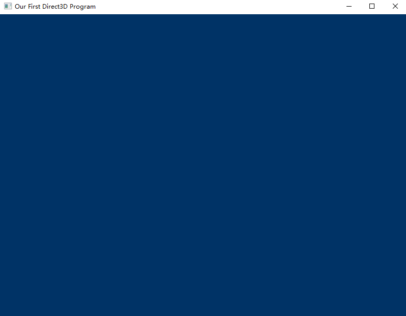

# Render Target

首先得确定一个渲染的目标，逻辑上，我们可以说渲染整个back buffer（**以下简称bb**）就好了嘛，但是D3D不会给你这样玩。因为用户可能不需要马上渲染所有东西，就像玩游戏的时候，经常都是先渲染Model的表面，然后才是背景和所有bb的东西

所以渲染的时候，你必须先创建好渲染目标（**Render Target，以下简称rt**），所谓渲染对象就是一个简单的COM 对象，用于维护你需要渲染的目标在video memo中的位置，大多数情况下，这个就是我们的bb

```cpp
ID3D11RenderTargetView *backbuffer;    // back buffer的指针

void InitD3D(HWND hWnd)
{
    // Direct3D 初始化，和前面一样
    // ...

    //取到bb的地址
    ID3D11Texture2D *pBackBuffer;
    swapchain->GetBuffer(0, __uuidof(ID3D11Texture2D), (LPVOID*)&pBackBuffer);

    // 用这个地址创建一个rt
    dev->CreateRenderTargetView(pBackBuffer, NULL, &backbuffer);
    pBackBuffer->Release();

    // 将当前使用的rt设为bb
    devcon->OMSetRenderTargets(1, &backbuffer, NULL);
}
```

# Setting the Viewport

这步其实是在规定坐标的起始位置，也就是将我们的坐标转换为渲染的标准坐标

```cpp
void InitD3D(HWND hWnd)
{
    // Direct3D initialization
    // ...

    // Set the render target
    // ...

    // Set the viewport
    D3D11_VIEWPORT viewport;
    ZeroMemory(&viewport, sizeof(D3D11_VIEWPORT));

    viewport.TopLeftX = 0;
    viewport.TopLeftY = 0;
    viewport.Width = 800;
    viewport.Height = 600;

    devcon->RSSetViewports(1, &viewport);
}
```


# Rendering Frames

```cpp
// 渲染一个单体Frames
void RenderFrame(void)
{
    // 为我们的rt指定一个蓝色的Frames
    devcon->ClearRenderTargetView(backbuffer, D3DXCOLOR(0.0f, 0.2f, 0.4f, 1.0f));

    // do 3D rendering on the back buffer here

    // 交换front buffer 和 back buffer
    swapchain->Present(0, 0);
}
```


# Clean up

```cpp
// 回收内存
void CleanD3D()
{
    swapchain->Release();
    backbuffer->Release();
    dev->Release();
    devcon->Release();
}
```


# Gotcha！



窗口变成蓝色了，说明我们成功了